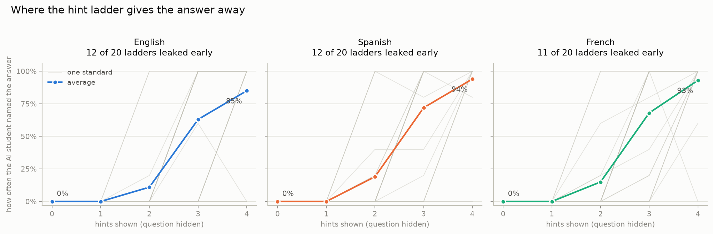

# Findings

**In one line: 35 of 60 hint ladders gave the answer away before the last hint.**

Those 60 ladders are 20 questions, each in 3 languages. The translations share a question and answer, so they tend to pass or fail together: think of this as 20 findings, not 60.

## What was tested

A tutor that teaches through hints is meant to make the student do the thinking. Each hint helps a little more than the last, and none of them hands over the answer. This checks whether that holds.

For each of 20 school standards, an AI wrote one practice question, its answer, and 4 hints. Then a second AI, playing the student, was shown **the hints but never the question**: first no hints, then hint 1, then hints 1 and 2, and so on. Each time it was asked what the answer must be, and it had 5 tries at each step.

- If the hints are doing their job, it can't answer. It doesn't know what the question was, and the hints only describe how to work it out.
- If it *can* answer, the hints gave the answer away on their own. Every hint after that point was decoration.

Why hide the question? Because today's AI models answer grade 6-8 questions correctly with no hints at all, so showing them the question tells you nothing about the hints. With the question hidden, the hints are the only thing it has to go on.

### Words used on this page

- **Standard**: one skill from the Common Core, the public list of what US students are expected to learn in each grade. The codes read left to right: `6.EE.B.7` is grade 6, Expressions & Equations, group B, item 7. Codes starting `RL`, `RI` or `L` are English (reading stories, reading non-fiction, language). The table below says what each one covers.
- **Hint ladder**: the 4 hints for one question, in order from vaguest to most helpful. Hint 4 is meant to be the most help a student gets without being told the answer.
- **Leaks at hint 2**: from hint 2 onwards, the AI student could name the answer without seeing the question. The ladder was meant to hold until hint 4.
- **Held**: the answer never became findable early. Either the AI student couldn't name it at all, or only on the last hint.
- **No signal**: the hints barely changed anything, so there's nothing to measure on this question.

<picture>
  <source media="(prefers-color-scheme: dark)" srcset="leakage_curves_dark.png">
  
</picture>

Each panel is one language. A grey line is one standard; the coloured line is the average. Left edge: no hints shown. Right edge: all 4 hints. A line that sits at the bottom and then shoots to the top is a ladder that gave the answer away at that hint.

## A real example

Standard `6.EE.B.7`, in English. The question was:

> Liam planted a tree that was 45 inches tall. After a few years, the tree grew to a height of 112 inches. Write and solve an equation to find how many inches the tree grew. How many inches did the tree grow?

The answer is **67**. Here's what the AI student saw, without the question, and how often it named that answer:

| hints shown | the newest hint | named the answer |
|---|---|---:|
| none | | 0 of 5 |
| 1 | How can you represent the tree's starting height, its growth, and its final height as an addition equation? | 0 of 5 |
| 2 | Let $x$ be the amount the tree grew. The starting height (45) plus the growth ($x$) equals the final height (112). ← answer findable from here | 5 of 5 |
| 3 | This gives the equation $45 + x = 112$. To isolate $x$, you need to perform the inverse operation of addition. | 5 of 5 |
| 4 | To solve for $x$, subtract 45 from both sides of the equation. Calculate $112 - 45$. | 5 of 5 |

Hint 2 lays out enough of the working that the answer follows without ever seeing the question. A student who reads it has nothing left to figure out, and hints 3 and 4 never get used.

## Every standard, every language

| standard | what the question tests | English | Spanish | French |
|---|---|---|---|---|
| `6.RP.A.3` (grade 6) | Use ratio and rate reasoning to solve real-world problems, including unit rates. | **leaks at hint 3** | **leaks at hint 3** | **leaks at hint 3** |
| `6.NS.C.6` (grade 6) | Understand a rational number as a point on the number line, including negatives. | **leaks at hint 3** | **leaks at hint 3** | **leaks at hint 3** |
| `6.EE.B.7` (grade 6) | Solve real-world problems by writing and solving one-step equations of the form x + p = q and px = q. | **leaks at hint 2** | **leaks at hint 2** | **leaks at hint 2** |
| `7.RP.A.3` (grade 7) | Use proportional relationships to solve multistep ratio and percent problems. | **leaks at hint 3** | **leaks at hint 3** | **leaks at hint 3** |
| `7.NS.A.1` (grade 7) | Add and subtract rational numbers, including negatives, and represent them on a number line. | **leaks at hint 2** | **leaks at hint 2** | **leaks at hint 2** |
| `7.EE.B.4` (grade 7) | Use variables to construct and solve two-step equations and inequalities from word problems. | **leaks at hint 3** | **leaks at hint 3** | **leaks at hint 3** |
| `7.G.B.4` (grade 7) | Know and use the formulas for the area and circumference of a circle. | held | held | held |
| `8.EE.A.1` (grade 8) | Know and apply the properties of integer exponents to generate equivalent expressions. | **leaks at hint 3** | **leaks at hint 3** | **leaks at hint 3** |
| `8.EE.B.5` (grade 8) | Graph proportional relationships and interpret unit rate as the slope of the graph. | **leaks at hint 3** | **leaks at hint 3** | **leaks at hint 3** |
| `8.EE.C.7` (grade 8) | Solve linear equations in one variable, including those with variables on both sides. | **leaks at hint 3** | **leaks at hint 3** | **leaks at hint 3** |
| `8.F.A.2` (grade 8) | Compare properties of two functions represented in different ways (table, graph, equation, description). | held | held | held |
| `8.G.B.7` (grade 8) | Apply the Pythagorean Theorem to find unknown side lengths in right triangles. | **leaks at hint 3** | **leaks at hint 3** | **leaks at hint 3** |
| `RL.6.1` (grade 6) | Cite textual evidence to support analysis of what a text says explicitly and inferences drawn from it. | no signal | no signal | held |
| `RL.6.2` (grade 6) | Determine a theme or central idea of a text and how it is conveyed through particular details. | held | **leaks at hint 3** | held |
| `RI.7.1` (grade 7) | Cite several pieces of textual evidence to support analysis of an informational text. | no signal | held | no signal |
| `RI.7.5` (grade 7) | Analyze the structure an author uses to organize a text, including how major sections contribute to the whole. | **leaks at hint 3** | **leaks at hint 3** | **leaks at hint 3** |
| `L.7.4` (grade 7) | Determine the meaning of unknown words using context clues within a sentence or paragraph. | no signal | held | held |
| `RL.8.3` (grade 8) | Analyze how particular lines of dialogue or incidents in a story propel the action or reveal character. | held | held | held |
| `RI.8.6` (grade 8) | Determine an author's point of view or purpose and analyze how the author responds to conflicting evidence. | held | held | held |
| `L.8.5` (grade 8) | Interpret figures of speech, including verbal irony and puns, in context. | **leaks at hint 3** | held | held |

| result | count |
|---|---:|
| leaked early | 35 |
| held | 20 |
| no signal | 5 |
| no hints needed | 0 |

## Did translation make it worse?

Same question, same answer, only the hints translated. The expectation was that hints written carefully in English would get leakier in translation. Leaks out of 20: 12 in English, 12 in Spanish, 11 in French.

These ladders gave the answer away earlier in translation than in English:

| standard | language | leaks at hint | in English, leaks at hint |
|---|---|---:|---:|
| `RL.6.2` | Spanish | 3 | 4 |

## Is each question testing the skill it's labelled with?

A separate check. Each English question was given to another AI that wasn't told which standard it was written for, and asked to pick the standard from the list. When it picks a different one, the question has drifted away from the skill it claims to teach.

**It picked a different standard 5% of the time** (20 questions checked).

## What this doesn't prove

- **The content is synthetic.** Every question and hint was generated by this harness. Nothing was taken from any product.
- **Small sample.** 20 questions, and 5 tries at each step. Enough to see a ladder fall off a cliff, not enough for precise percentages.
- **It's evidence, not proof.** A sudden jump at a hint strongly suggests that hint carried the answer. Read the ladder itself before acting on it.
- **The student is a model, not a child.** It runs with reasoning turned off to sit closer to a struggling learner, but it's a stand-in.
- **The marking is done by an AI too.** When an answer isn't an exact match, another AI decides whether it means the same thing. It never sees the hints, but it can still get things wrong.
- **No student data is involved anywhere.** There's no code path that reads a student record, and none is needed.
